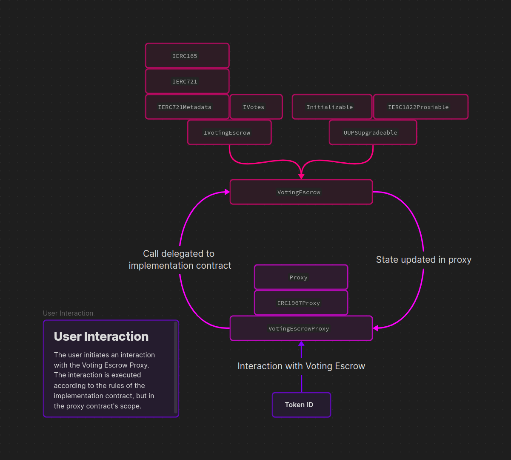
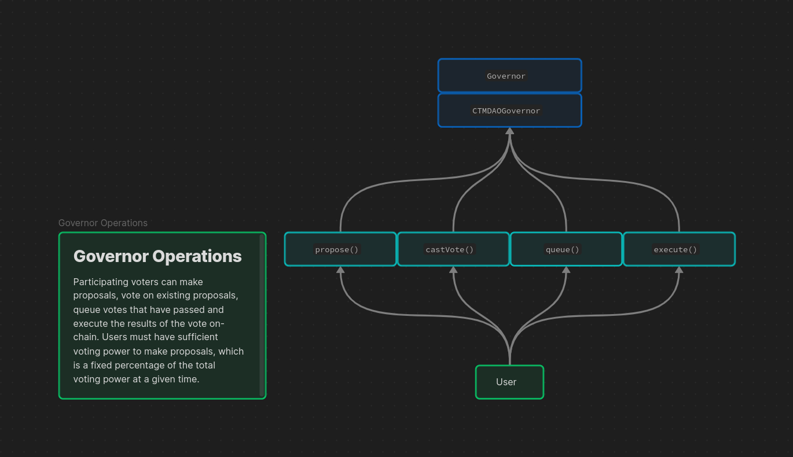

### Voting Escrow - How does it work?

Users can create a lock - a position which locks an amount of CTM tokens $a$ for a specified amount of time $t_l$ (rounded by week) and weighs voting power $P$ based on $t_l$ and maximum lockable time $t_{max}$ (equal to 4 years).

***How is voting power calculated?***

$$P = a \times {t_l \over t_{max}}$$

### Contract Architecture

Modifying a copy of [Solidly Voting Escrow code](https://web.archive.org/web/20220501080953/https://github.com/solidlyexchange/solidly/blob/master/contracts/ve.sol), using OpenZeppelin [Governor Votes](https://github.com/OpenZeppelin/openzeppelin-contracts/blob/v5.0.1/contracts/governance/utils/Votes.sol) to support Governance.

OpenZeppelin [UUPS Proxy](https://docs.openzeppelin.com/contracts/5.x/api/proxy#UUPSUpgradeable) patterns are used, complying to ERC-1967.

### VotingEscrow Topology Diagram



### CTMDAOGovernor Topology Diagram



### Compile and run tests

```bash
forge build
```

```bash
forge test -vv
```